# Image Processing and Computer Vision Studio

## Introduction

Welcome to our Image Processing and Computer Vision Studio! This project, developed as part of the Computer Vision course at Cairo University, provides a collection of image processing tools.

## Setup and Installation

To set up the Filtering and Edge Detection Studio environment, follow these steps:

1. Install the required packages by running the command:
   ```bash
   pip install -r requirements.txt
    ```
2. Run the main file
   ```bash
   python main.py
   ```

## Feature Outlines
1. Basic Operations, Filtering and Edge Detection
2. Hough Tranforms and Shape Detection
3. Active Contour (Snake) Algorithm
4. SIFT
5. Corner Detection
6. Thresholding and Clustering
7. Face Recognition and Detection

## Basic Operations, filters and Edge Detection
### Histograms and Distribution Curves
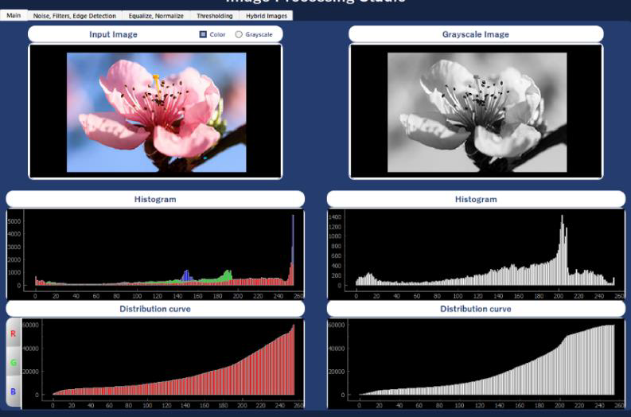
Calculates the frequency distribution of pixel values to draw histograms for both colored and greyscale images. It includes cumulative distributions to analyze pixel value accumulations.

### Noise Addition

- **Uniform Noise:** Adds consistent graininess to an image, with intensity spread uniformly across the image.

- **Gaussian Noise:** Introduces smooth variations in pixel intensities, creating a blurred appearance.
- **Salt-and-Pepper Noise:** Adds random white and black pixels to the image, creating a speckled effect with extreme outliers.

### Filtering
- **Gaussian Filter:** Uses a Gaussian kernel to smooth or blur images while preserving edges.
- **Average Filter:** Averages pixel intensities within a kernel window to smooth images and reduce noise.
- **Median Filter:** Replaces pixel intensities with the median value from a kernel window, particularly effective for removing salt-and-pepper noise.


### Edge Detection
- **Prewitt Edge Detection:** Highlights edges using gradient calculations based on predefined kernels.
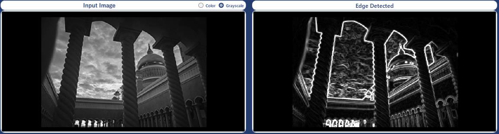
- **Roberts Edge Detection:** Detects edges using a pair of 2x2 convolution kernels to calculate gradients.
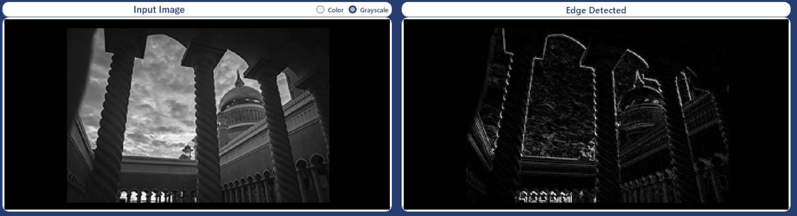
- **Sobel Edge Detection:** Calculates gradient magnitude and optionally direction to detect edges, offering robustness against noise.
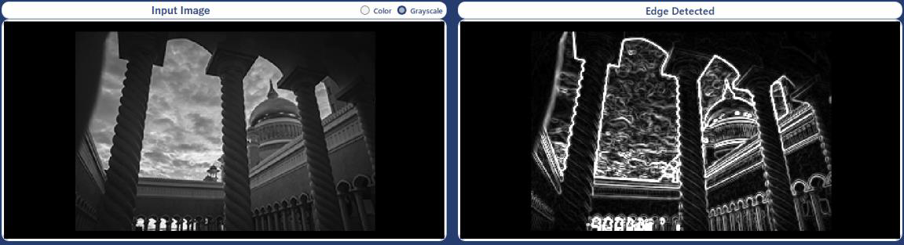
- **Canny Edge Detection:** Applies Canny edge detection, including conversion to grayscale, Gaussian filtering, gradient calculation, non-maximum suppression, and hysteresis thresholding.
<figure>
    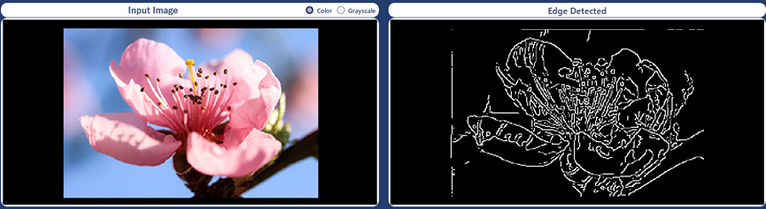

</figure>
<figure>
    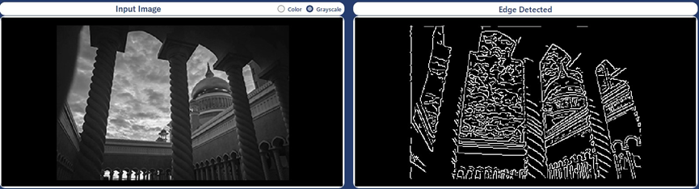
    <figcaption>Canny Edge Detector Samples</figcaption>
</figure>


### RGB to LUV Conversion
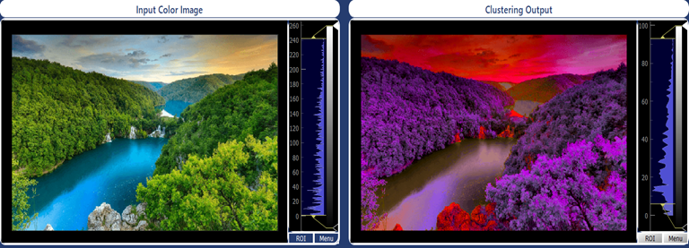
The LUV color space is a perceptually uniform color space designed to align with human vision. It represents color in three components: L (luminance), U, and V (chromaticity).

### Histogram Equalization
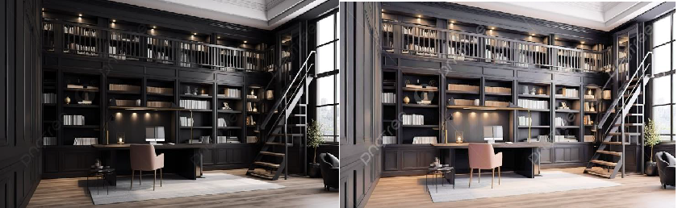
Enhances image contrast by redistributing intensity levels to cover the full range of pixel values. This method improves visibility and detail by adjusting brightness without altering color balance.

### Image Normalization
Scales pixel values to a specific range to ensure consistent processing and display, avoiding issues like saturation and ensuring that pixel intensities span the desired interval.

### Hybrid Image Generation
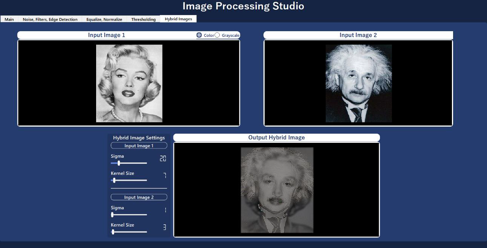
Combines two images by blending high-frequency details from one with low-frequency content from another. This technique reveals distinct features depending on viewing distance, with close-up views showing fine details and distant views showing overall structure.

## Hough Transform and Detection
Detects different shapes using Hough Transform by converting to grayscale, applying Gaussian blur, Canny edge detection, updating a Hough accumulator array and finding its peaks to detect these shapes. It includes:

- **Line Detection** 
<br>
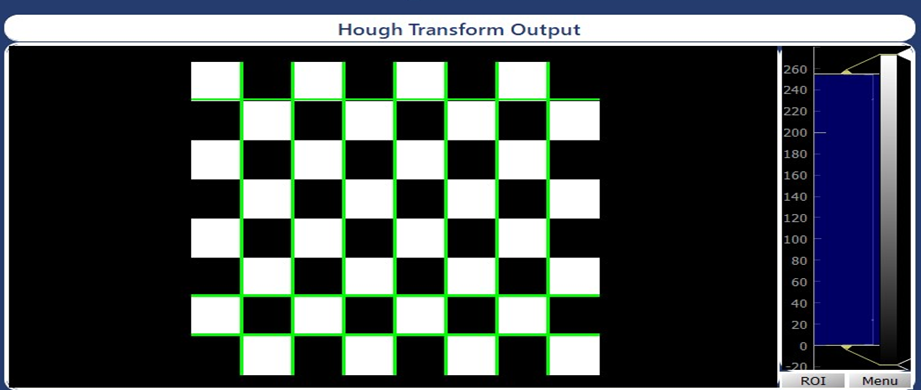

- **Circle Detection** 
<br>
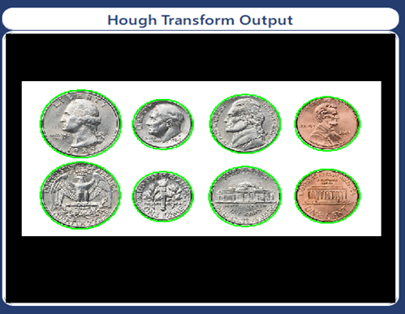

- **Ellipse Detection** 
<br>
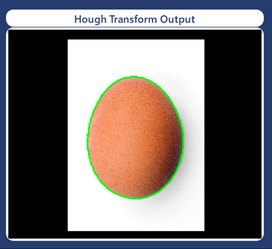

## Active Contour Model (Snake Algorithm)
Active Contour (Snake) is a computer vision technique used for image segmentation and edge detection. It dynamically adjusts a curve to delineate object boundaries by balancing internal smoothness and external image features.
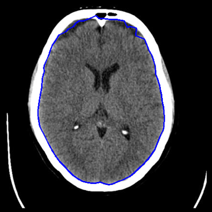

- **Initial Contour Generation:** Creates a circular contour centered in the image, with a radius proportional to the image size.
- **Internal Energy Calculation:** Evaluates the contour's internal energy, factoring in elasticity and stiffness based on point distances and curvature.
- **External Energy Preparation:** Applies Gaussian blur and Sobel edge detection to the image to prepare external energy components for active contours.
- **External Energy Computation:** Calculates external energy at a specific point by combining intensity and gradient information with given weights.
- **Contour Iterative Update:** Iteratively updates the contour based on internal and external energy, visualizing the contour on the image.

### Area and Parameter Calculation
Using its vertex coordinates of the active contour.

### Chain Code Generation

Using 8-connected Chain code rules.
## Corner Detection
Identifying corners, edges, and flat areas in the image based on the response of a corner detection operator
### Harris and λ- Operators

- **Harris Corner Detection:**  
The Harris corner detection algorithm identifies corners in an image by analyzing the gradient of the image. It detects regions where the gradient changes significantly in multiple directions, indicating a corner point.

- **λ- Operator:**  
The λ- corner detection operator finds corners based on the sum of squared gradients within a window around each pixel. It calculates the eigenvalues of the gradient matrix to determine the corner response.

## SIFT

The SIFT algorithm is used to detect and describe local features in images. It is particularly effective for matching key points between different images of the same object or scene, even when there are changes in scale, rotation, and illumination. Steps include


- **Scale Space Formation:**  
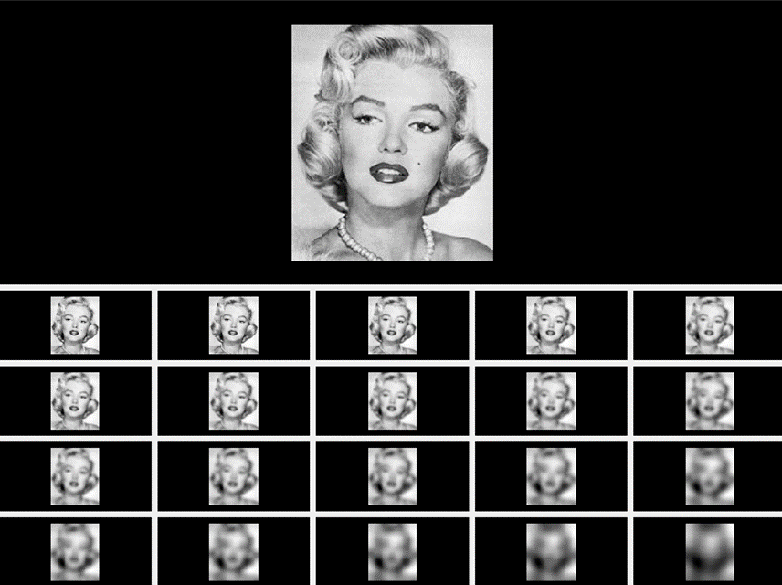
Constructs multiple scales and octaves of the image by applying Gaussian kernels. The Difference of Gaussians (DOGs) is computed by subtracting successive scales to detect features across different scales.

- **Key Point Detection:**  
Key points are detected by comparing each point in the image with its neighbors. Points that are local maxima or minima in their neighborhood are identified as key points.

- **Orientation Assignment:**  
Orientation is assigned to key points based on gradient information. The dominant orientation is computed by analyzing the gradient magnitude and direction within a defined window around each key point.


- **Feature Descriptor Generation:**  
Descriptors for key points are computed based on gradient magnitude and orientation. A 16x16 region around each key point is analyzed to construct histograms of oriented gradients (HOG), which are used for matching and recognition.

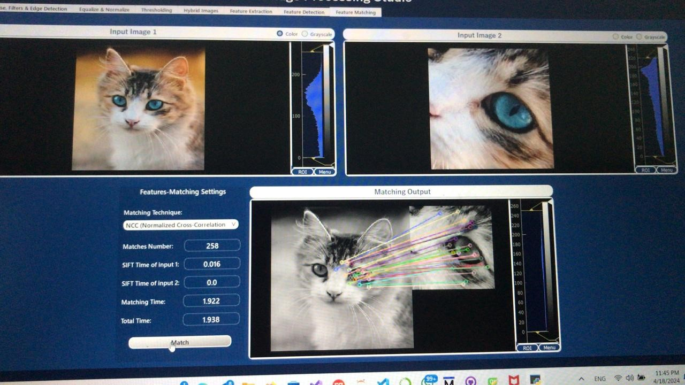

## Thresholding and Clustering
### K-Mean Clustering Technique 
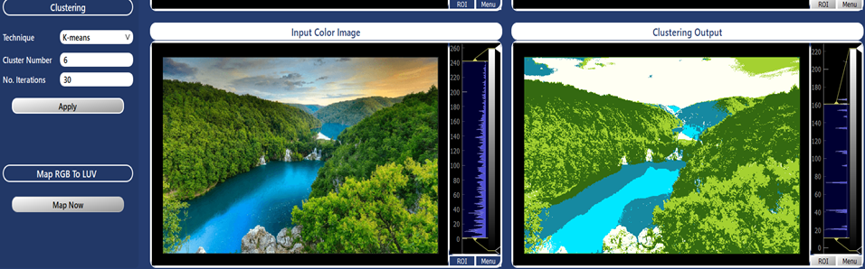
Implements the KMeans clustering algorithm, used to partition data into distinct clusters based on their features.


### Mean Shift Cluster Technique
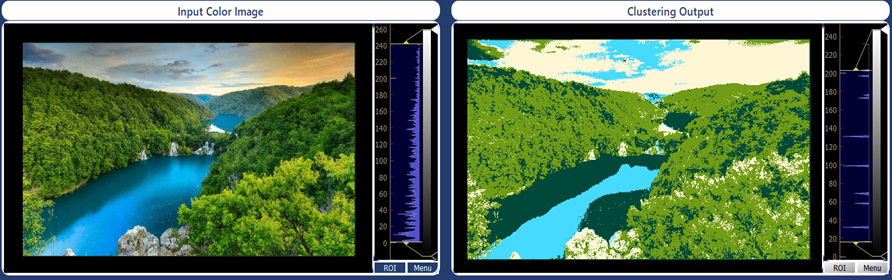
Represents the Mean Shift clustering algorithm, clustering data based on density distributions.

### Agglomerative Hierarchical Clustering
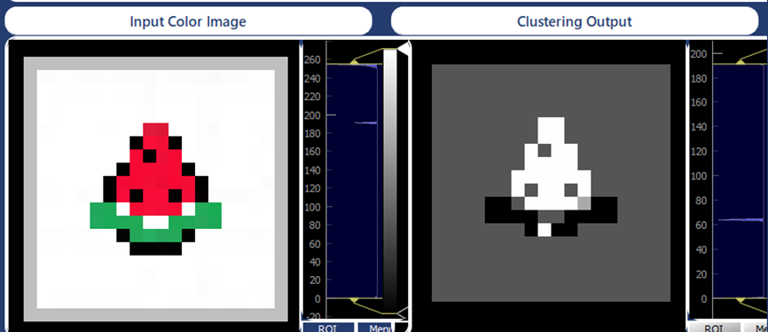
Performs agglomerative clustering by starting with individual data points and merging clusters based on distances until the desired number of clusters is achieved.

### Region Growing Method
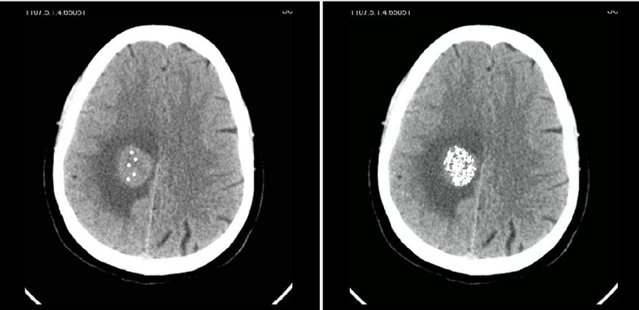
Performs region growing on an image based on a similarity threshold (intensity differences), converting the image to Luv color space and iterating from seed points to grow regions.

### Optimal Thresholding
- **Global Optimal Threshold Function**  
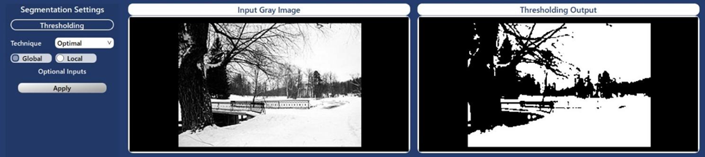
Applies an iterative method to separate an image into foreground and background based on calculated mean pixel values.
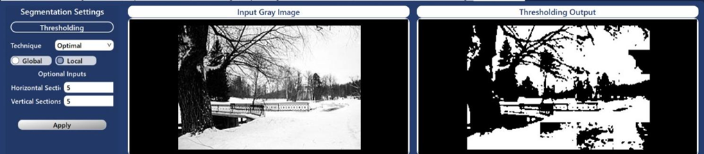
- **Local Optimal Threshold Function**  
Divides the image into sections and applies the global optimal thresholding method to each section independently.

### Otsu Thresholding

- **Global Otsu Thresholding** 
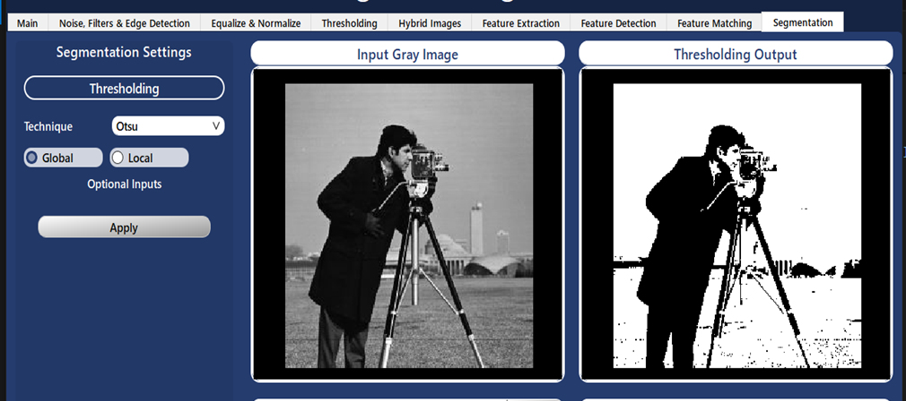 
Determines an optimal threshold by minimizing intra-class variance in a grayscale image.

- **Local Otsu Thresholding**  
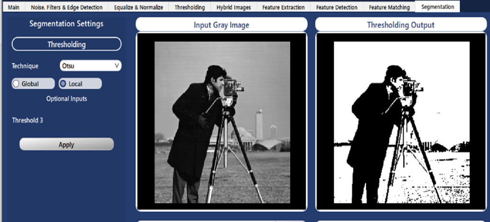
Splits the image into smaller sections and applies Otsu’s thresholding method to each section.

### Spectral Thresholding

- **Global Spectral Thresholding** 
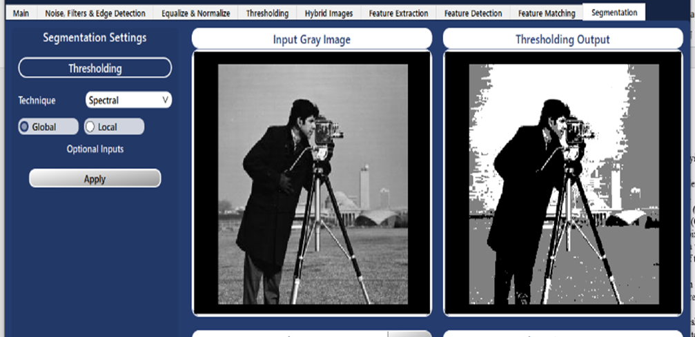 
Optimizes thresholds by analyzing the histogram and cumulative distribution of grayscale images.

- **Local Spectral Thresholding**
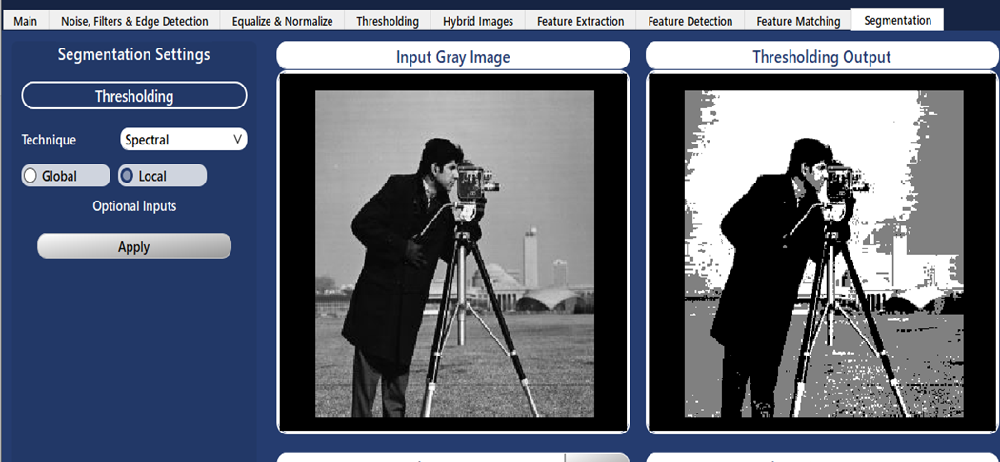  
Divides the image into sections, applies global spectral thresholding to each section, and reconstructs the image by combining the thresholded sections.

## Face Detection and Recognition

### Face Detection
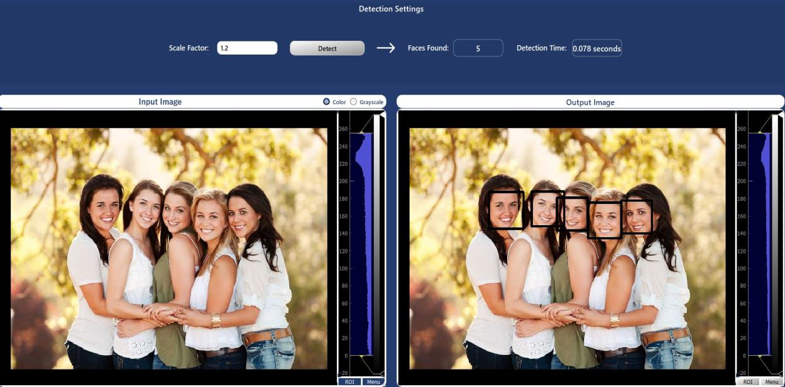

Performs face detection on an input image using Haar cascades. It identifies both frontal and side faces, annotates the detected faces with rectangles, and provides metrics such as detection time and the number of faces found.

### Face Recognition
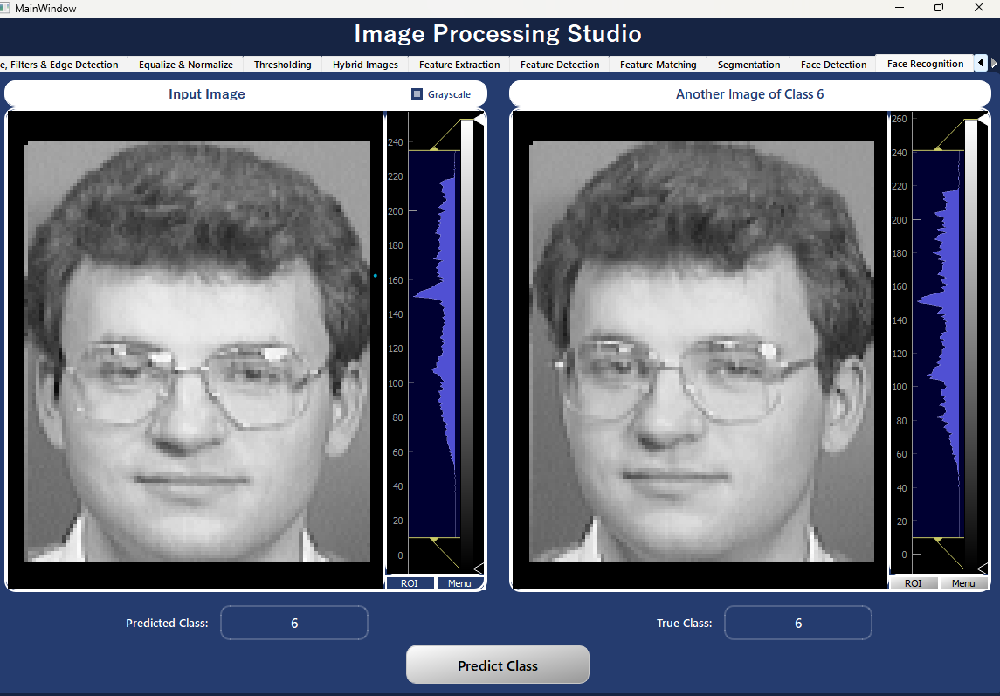

The dataset consists of 400 grayscale images of 40 subjects, with each subject having 10 images. It is split into 80% for training and 20% for testing. The face recognition system achieved an accuracy of 86.25%.

Using *PCA* (implemented from scratch) to find the eigenfaces to reduce dimensionality and *KNN* Classifier for subject identification.


## Contributors

<table>
  <tr>
    <td align="center">
    <a href="https://github.com/Ayamachii" target="_black">
    
    <br />
    <sub><b>Aya Eyad</b></sub></a>
    <td align="center">
    <a href="https://github.com/hagersamir" target="_black">
    
    <br />
    <sub><b>Hagar Samir</b></sub></a>
    </td>
    </td>
    <td align="center">
    <a href="https://github.com/Sarah2332" target="_black">
    
    <br />
    <sub><b>Sara Ragaei</b></sub></a>
    </td>
    <td align="center">
   <td align="">
    <a href="https://github.com/Salma-me" target="_black">
    
    <br />
    <sub><b>Salma Ashraf</b></sub></a>
    </td>
    <td align="center">
    <a href="https://github.com/HabibaSroor" target="_black">
    
    <br />
    <sub><b>Habiba Salama</b></sub></a>
    </td>
    </tr>
 </table>
